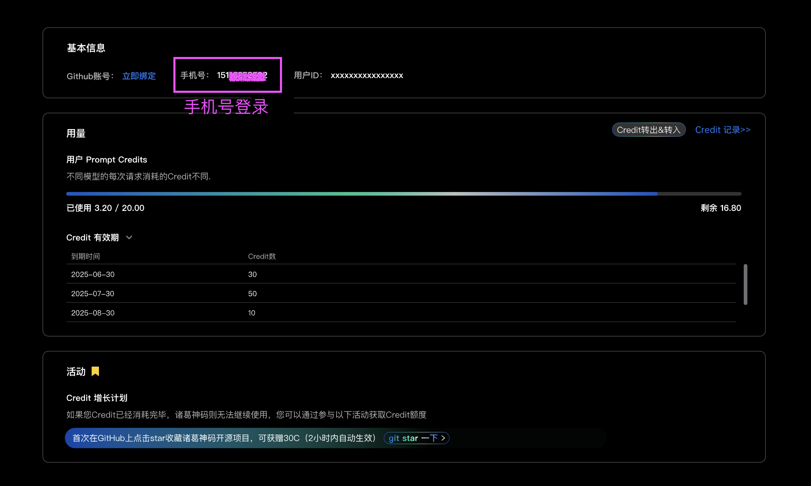

# Getting Credits

First, please determine if your login account is linked to GitHub or a phone number. If you are unsure which account you are using, you can visit the **User Info & Credit Usage** page to verify. This page also displays your remaining credit balance.
If you log in with a phone number, we recommend linking your GitHub account on this page to easily receive credit rewards from future GitHub-related promotions.

**Star the Costrict open-source project on GitHub to receive an additional 50 Credits.**

### Scenario 1: For Users Logging in with GitHub

If you log in with your GitHub account, simply click the link below and star the Costrict project to receive an additional 50 Credits. The credits will be added to your account in approximately 2-3 minutes.

[https://github.com/zgsm-ai/costrict](https://github.com/zgsm-ai/costrict)

After starring the project, you can return to the VSCode extension and resume your work.

### Scenario 2: For Users Logging in with a Phone Number

If you log in with a phone number, you first need to link your GitHub account on the **User Info & Credit Usage** page. (You can navigate to this page from within the VSCode extension by clicking the "View Credit Usage" button under `Settings > Credit Usage Management`.)
If you do not have a GitHub account, the system will guide you through the registration process.

After linking your account, click the link below and star the Costrict project to receive an additional 50 Credits. The credits will be added to your account in approximately 2-3 minutes.

[https://github.com/zgsm-ai/costrict](https://github.com/zgsm-ai/costrict)

After starring the project, you can return to the VSCode extension and resume your work.