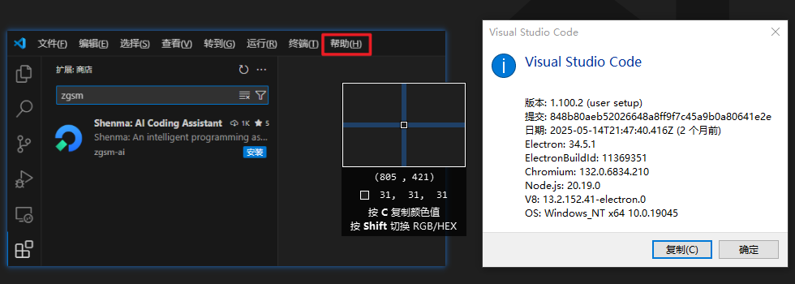
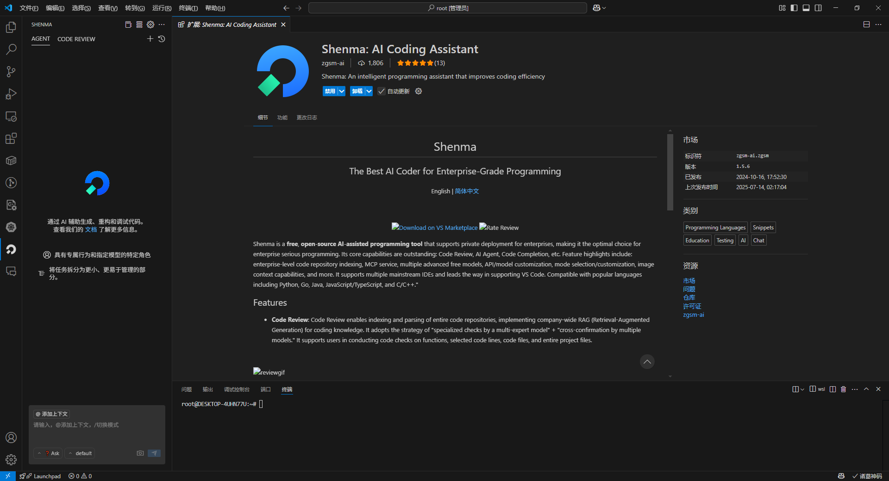

# Installation

:::tip

The minimum supported version of VS Code for ZGSM is `1.86`. We recommend updating to the latest version of VS Code for the best experience.

  
Check your current version

  

:::

### Extension Installation

- Search for `zgsm / shenma` in the VS Code Marketplace.
- Click "Install".

  
Click the icon in the sidebar. The interface below will appear after a few seconds, confirming a successful installation.

  

