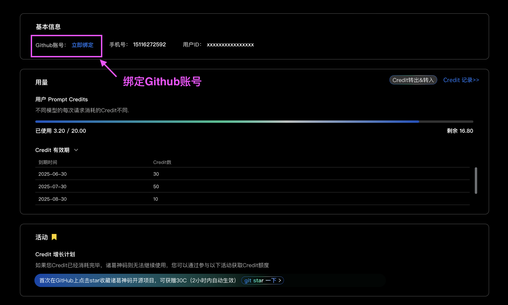

# Get credits

First, determine if you are logged in with a GitHub account or a phone number. If you are unsure which account you're using, you can visit the **User Info & Credit Usage** page. This page also shows your remaining Credit balance.

If you logged in with a phone number, we recommend binding your GitHub account on this page. This will make it easy to receive Credit rewards from future GitHub-related promotional activities.

---

### Star on GitHub for 50 Extra Credits

You can receive an **additional 50 Credits** by starring the Costrict open-source project on GitHub.

### Scenario 1: For Users Logged In with GitHub

If you logged in with your GitHub account, simply follow the link below and star the Costrict project to receive your 50 Credits. The credits will be added to your account in about 2-3 minutes.

**Link:** [https://github.com/zgsm-ai/costrict](https://github.com/zgsm-ai/costrict)

After starring the project, you can return to the VSCode extension and continue using it.

---

### Scenario 2: For Users Logged In with a Phone Number

If you logged in with your phone number, you must first bind your GitHub account.

1.  **Bind Your GitHub Account**
    Go to the **User Info & Credit Usage** page to bind your GitHub account. 
    *(You can also navigate to this page from the VSCode extension by clicking **Settings > Credit Usage Management**, then the **"View Credit Usage"** button).*

    If you don't have a GitHub account, the system will guide you through the registration process.

    

2.  **Star the Project**
    After binding your account, click the link below and star the Costrict project to receive an additional 50 Credits. The credits should appear in your account within 2-3 minutes.

    **Link:** [https://github.com/zgsm-ai/costrict](https://github.com/zgsm-ai/costrict)

    

After starring the project, you can return to the VSCode extension and continue using it.