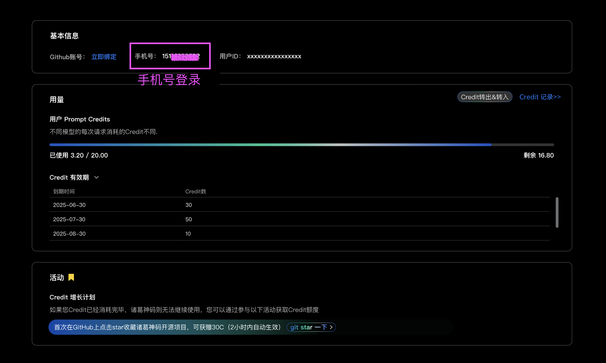
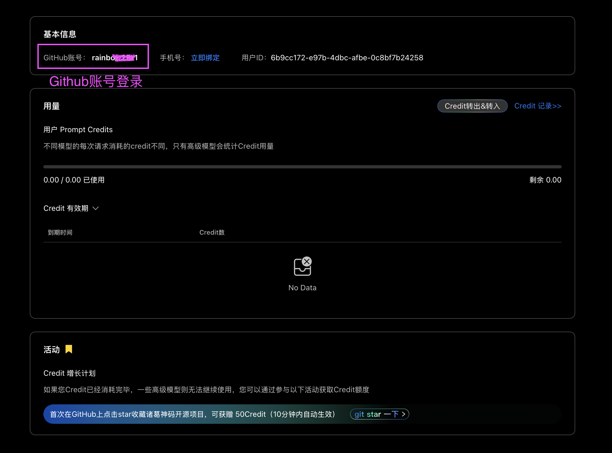
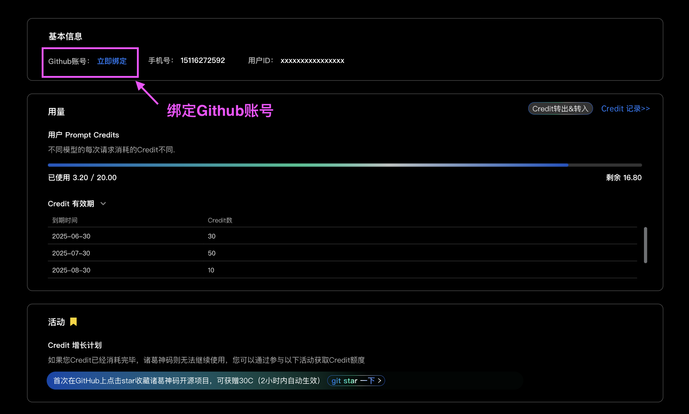

# 配额获取

首先明确您的登录账号是Github还是手机号，如果您对登录的账号不清楚，可前往用户信息&配额用量网页查看，该页面还可以查看您剩余的Credit 用量。
如果您是手机号登录的，建议在该页面绑定Github账号，方便后续参与github相关运营活动的Credit 额度赠送。

在GitHub上点亮star收藏Costrict开源项目即可获得额外 50 Credit

场景1：Github账号登录的用户

如果您是Github账号登录的用户，请点击链接地址：https://github.com/zgsm-ai/costrict  点亮star 收藏Costrict项目即可获得额外 50 Credit。到账大约需要2-3分钟。

收藏项目后返回VSCode插件端即可正常使用了。

场景2：手机号登录的用户

如果您是手机号登录的用户，需要先在用户信息&配额用量页面绑定你的github账号（VScode端点击”设置> Credit用量管理“页面的”查看Credit 用量“按钮也可以跳转至该页面）。
如果没有Github账号，系统会引导您先注册一个账号。

绑定后点击链接地址：https://github.com/zgsm-ai/costrict  点亮star 收藏Costrict项目即可获得额外 50 Credit。到账大约需要2-3分钟。

收藏项目后返回VSCode插件端即可正常使用了。