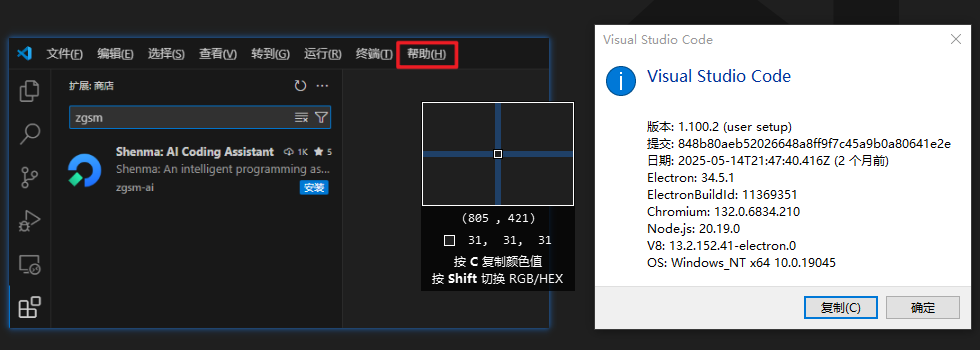
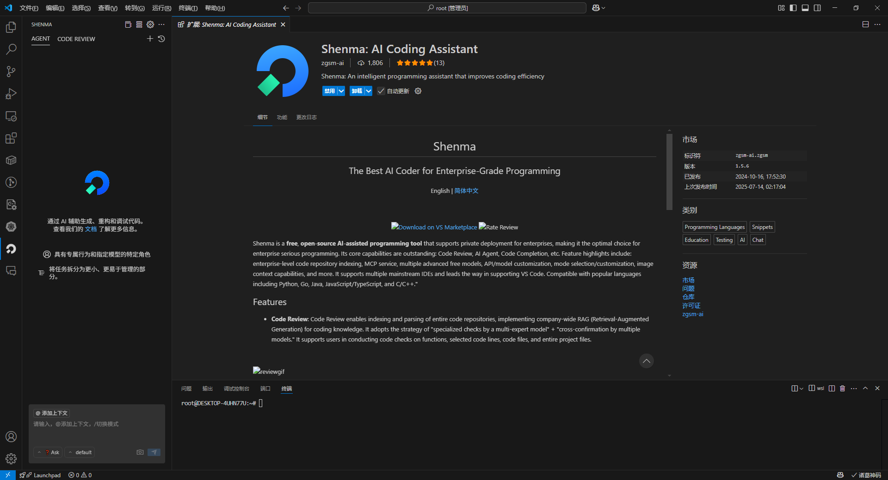

# 安装流程

:::tip

诸葛神码支持的 `vscode` 最低版本是 `1.86`，建议升级到最新的 `vscode` 版本以获得最佳的使用体验

  
 检查当前版本 

:::

### 插件安装

- 在 `vscode` 插件商城中搜索 `zgsm / shenma / costrict` 
- 点击安装

  
 点击右侧的图标, 等待几秒出现如下界面, 即视为安装成功 

